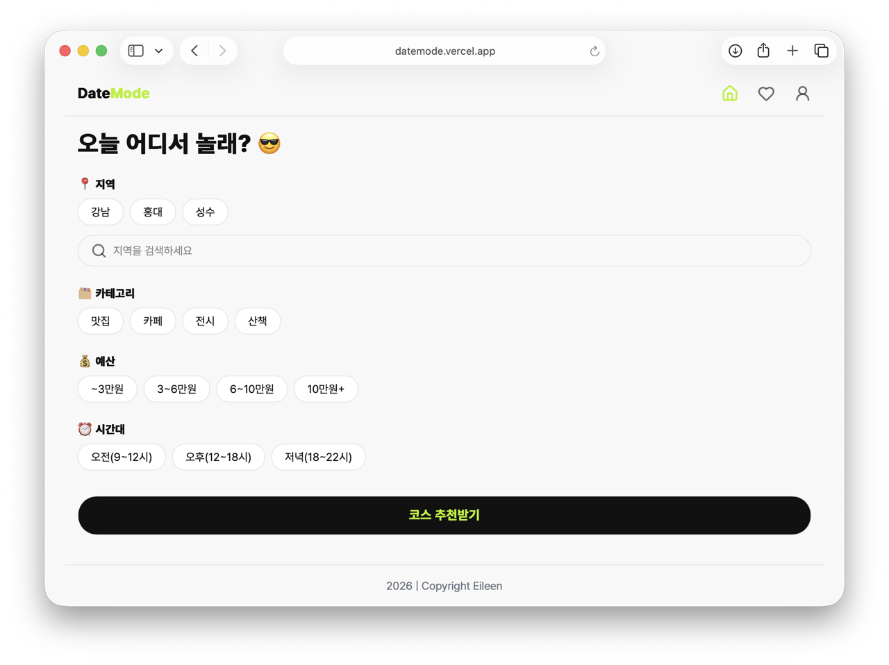
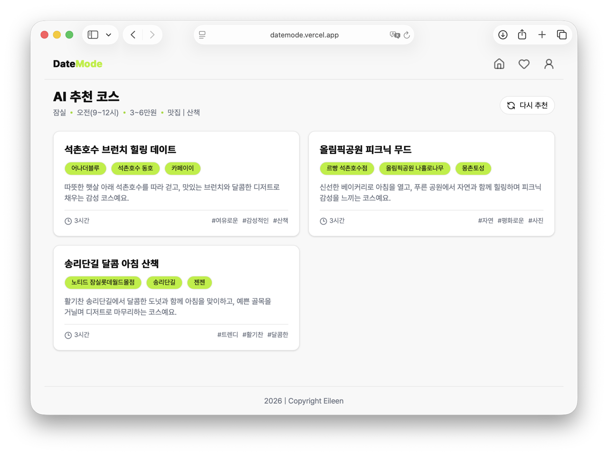
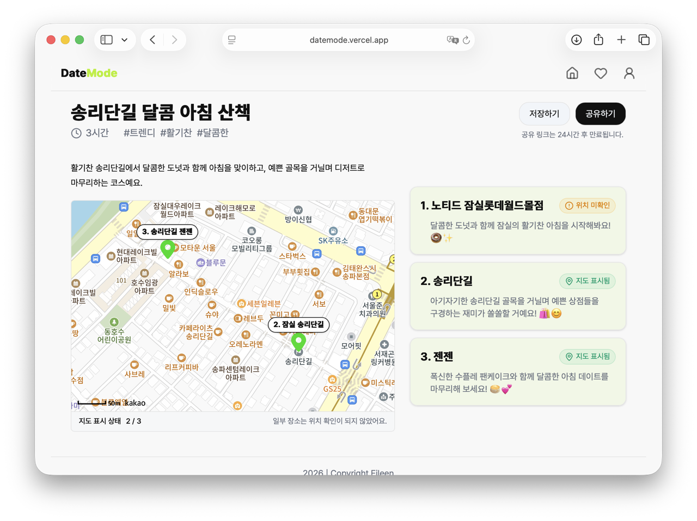
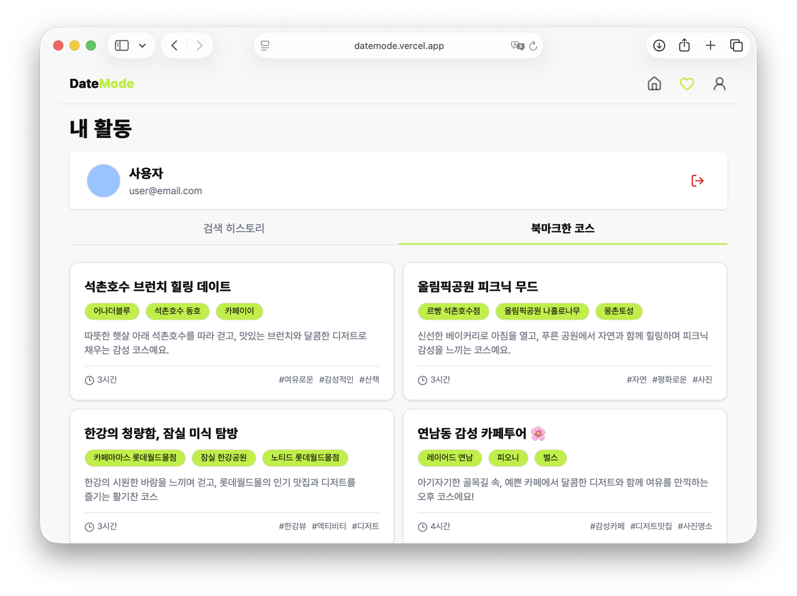
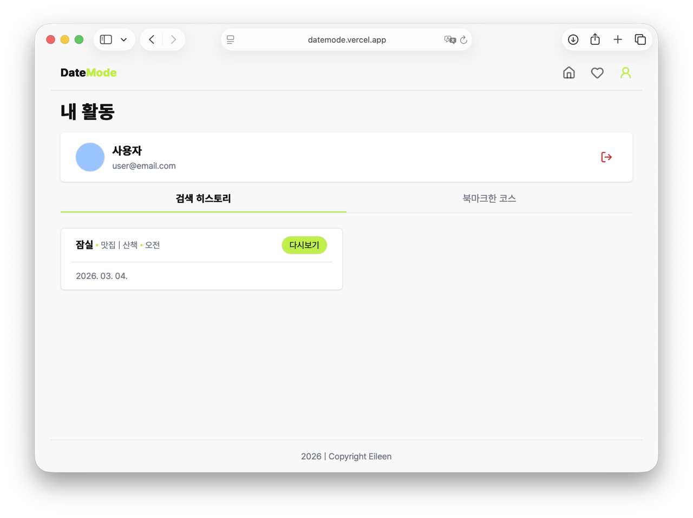
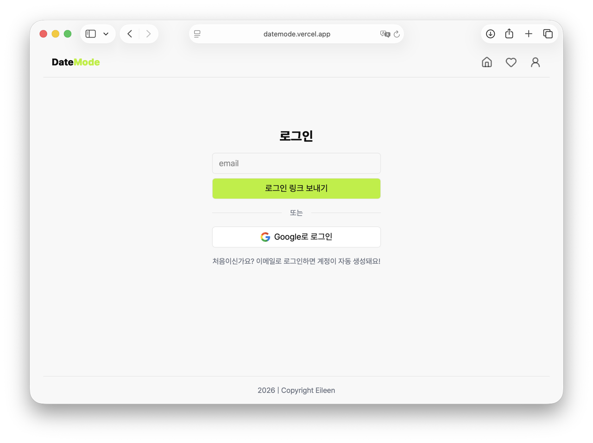
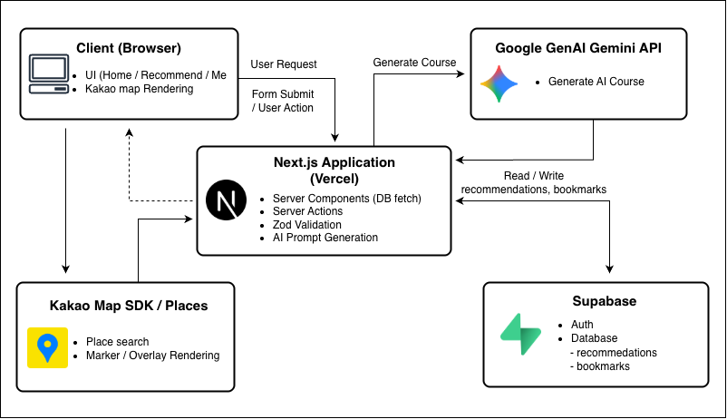

# DateMode

### 👀 오늘 어디 갈까? AI가 오늘의 데이트 코스를 추천해드려요!

🔗 **Demo:** [DateMode](https://datemode.vercel.app/)

> AI 기반 데이트 코스 추천 서비스  
> Next.js + Supabase + Gemini + Kakao Map



## 📌 프로젝트 개요

- DateMode는 사용자의 조건을 기반으로 AI가 맞춤형 데이트 코스를 생성하고 지도 기반으로 실제 방문 가능한 장소를 확인할 수 있도록 도와주는 웹 서비스입니다.
- 사용자는 지역, 카테고리, 예산, 시간대 등의 조건을 선택해 AI가 생성한 맞춤형 데이트 코스를 추천받을 수 있습니다.
- 추천된 장소는 지도에서 위치를 확인할 수 있어 실제 방문 가능한 데이트 코스를 직관적으로 탐색할 수 있습니다.
- 이 프로젝트는 기존 데이트 코스 검색 서비스가 단순한 리스트 형태로 정보를 제공하는 한계를 개선하고자 시작되었습니다. AI를 활용해 사용자 조건에 맞는 코스를 생성하고, 지도와 연동하여 실제 방문 가능한 장소를 직관적으로 확인할 수 있도록 구현했습니다.

  <br />

## 💡 주요 기능

### ✅ AI 데이트 코스 추천



- 사용자가 선택한 지역, 카테고리(맛집/카페/전시/산책), 예산, 시간대의 조건을 기반으로 AI가 단계별 데이트 코스를 생성합니다.
- 다시 추천 버튼을 통해 같은 조건으로 새로운 데이트 코스를 다시 생성할 수 있는 재추천 기능을 제공합니다.

### ✅ 코스 상세 확인 및 지도 기반 장소 확인



- 추천된 장소는 Kakao Map에 마커로 표시되어 데이트 코스의 위치를 직관적으로 확인할 수 있습니다.
- 각 장소에 대한 상세 설명을 함께 확인할 수 있습니다.
- 북마크에 저장하거나 다른 사용자에게 코스를 공유할 수 있습니다.

### ✅ 북마크 기능



- 마음에 드는 추천 코스를 저장하여 마이페이지에서 다시 확인할 수 있습니다.

### ✅ 히스토리 기능



- 사용자의 추천 기록을 확인할 수 있습니다.

### ✅ 로그인 기능



- Supabase Auth를 이용해 로그인 기능을 구현했습니다.  
  • Magic Link 로그인  
  • Google OAuth 로그인

<br />

## 🔎 역할과 기여도

- 개인 프로젝트로 **기획부터 설계, 개발, 배포까지 프론트엔드 전 과정을 단독으로 주도**하였습니다.
- AI 추천 데이터 → 지도 위치 검증 → 사용자 UI 표시까지의 데이터 흐름 설계
- Next.js App Router 기반 프론트엔드 구현
  - Next.js 16 App Router 기반의 서버/클라이언트 역할을 분리한 구조 설계
- 사용자 조건 기반 데이트 코스 생성
  - Google GenAI(Gemini)를 활용하여 AI가 데이트 코스를 생성하도록 프롬프트 설계
  - AI의 응답을 Supabase DB에 저장
  - 저장된 데이터는 24시간 이후에 삭제되도록 규칙 추가
    - DB 용량 관리를 위해 Supabase Edge Functions를 활용
- Kakao Map API를 활용한 지도 기반 장소 표시 기능 구현
  - AI의 응답 데이터를 바탕으로 Kakao Places를 활용한 장소 검색
  - Kakao Places로 검색된 장소만 지도에 표시하여 정보의 신뢰성 확보
- Supabase Auth를 활용한 로그인 기능 구현
  - Google OAuth, Magic Link를 이용한 로그인 제공
  - `getUser`를 활용하여 프로필 박스에 사용자의 정보를 UI에 동적으로 반영
- 추천 결과 저장 및 북마크 기능 구현
- Server Actions를 활용한 서버 데이터 처리
- Zod를 활용해 사용자 입력 데이터와 AI 응답 데이터를 스키마 기반으로 검증하는 구조 설계
- 예외 상황(장소 미검색/응답 스키마 불일치)에 대한 사용자 안내 및 fallback 처리
- Vercel을 통한 프로젝트 배포 및 환경 변수 관리

<br />

## 🏗️ 시스템 아키텍처



## 📁 프로젝트 구조

> Next.js App Router 기반 구조로 구성했으며  
> 도메인 단위로 컴포넌트를 분리하여 유지보수성과 확장성을 고려했습니다.

```
src
 ┣ actions     # 데이터 입력/삭제를 위한 Server Actions
 ┣ app         # Next.js App Router 기반 페이지 및 라우트 핸들러
 ┣ components  # 도메인별로 분리된 재사용 가능 UI 컴포넌트
 ┣ lib         # Supabase 클라이언트 및 유틸리티 로직
 ┗ types.ts    # 전역 타입 정의 (TypeScript)
```

<br />

## 🛠️ 사용한 기술 스택

| 구분       | 기술                          | 설명                                                                 |
| ---------- | ----------------------------- | -------------------------------------------------------------------- |
| Frontend   | Next.js 16, React, TypeScript | App Router 기반 서버/클라이언트 컴포넌트 구성 및 Server Actions 활용 |
| Styling    | Tailwind CSS                  | 유틸리티 기반 스타일링                                               |
| Backend    | Supabase                      | 인증(Auth) 및 추천 결과/북마크 데이터 저장                           |
| Server     | Next.js Server Actions        | AI 요청 및 서버 데이터 처리                                          |
| AI         | Google GenAI (Gemini)         | 사용자 조건 기반 데이트 코스 생성                                    |
| Validation | Zod                           | AI 응답 및 사용자 입력 데이터 스키마 검증                            |
| Map        | Kakao Map API                 | 추천 장소 지도 표시                                                  |
| Deployment | Vercel                        | 프로젝트 배포 및 환경 변수 관리                                      |

> AI 추천 기능은 Google GenAI(Gemini)를 활용하여 사용자의 조건을 기반으로
> 데이트 코스를 생성하고, Zod를 통해 응답 데이터를 검증하도록 구현했습니다.

<br />

## 🚀 배포 방법

### 🖥️ 로컬 실행 방법

**1️⃣ 프로젝트 클론 및 의존성 설치**

```bash
# 프로젝트 클론
git clone https://github.com/eileen819/datemode.git
cd datemode

# 의존성 설치
npm install
```

**2️⃣ 환경 변수 설정**

> `.env.local` 파일을 생성하고 다음 환경 변수를 설정합니다.

```env
NEXT_PUBLIC_SUPABASE_URL=
NEXT_PUBLIC_SUPABASE_ANON_KEY=
GEMINI_API_KEY=
KAKAO_MAP_API_KEY=
```

**3️⃣ 개발 서버 실행**

```bash
npm run dev
```

> 기본적으로 다음 주소에서 실행됩니다.

```
http://localhost:3000
```

**4️⃣ 프로덕션 빌드**

```bash
npm run build
npm start
```

### 🔹 자동 배포 (권장 방식)

- **Vercel과 GitHub 저장소를 연동**하여 CI/CD 방식으로 배포합니다.
  - `main` 브랜치에 코드가 push되면 자동으로 배포가 진행됩니다.
  - Pull Request 생성 시 **Preview 배포**가 생성되어 변경 사항을 확인할 수 있습니다.

- 배포 환경
  - **Preview Deployment**
    - Pull Request 또는 브랜치 push 시 임시 URL 생성
    - 기능 테스트 및 검증 용도

  - **Production Deployment**
    - `main` 브랜치 merge 시 자동 배포
    - 실제 서비스 도메인에 반영

### 🔹 수동 배포 (Vercel CLI)

Vercel CLI를 사용하여 로컬에서 직접 배포할 수 있습니다.

```bash
vercel        # Preview 배포
vercel --prod # Production 배포
```

<br />

## 🔄 개선 예정 기능 (업데이트 계획)

### ✔️ 검색 기록 삭제 기능

- 사용자가 생성한 추천 코스를 직접 관리할 수 있도록 **검색 기록 삭제 기능** 추가 예정
- Server Actions를 활용해 Supabase에 저장된 추천 기록을 삭제하도록 구현할 계획

### ✔️ 북마크 검색 기능

- 북마크에 저장된 추천 코스를 빠르게 찾을 수 있도록 **검색 기능** 추가 예정
- 키워드 기반 필터링을 통해 저장된 코스를 효율적으로 탐색할 수 있도록 사용자 경험을 개선할 계획

### ✔️ 라이트 모드 / 다크 모드

- 사용자 환경에 맞게 UI를 변경할 수 있도록 **라이트 모드 / 다크 모드 전환 기능** 구현 예정
- Tailwind CSS의 `dark mode` 기능을 활용해 테마 전환을 구현할 계획

  <br/>

## 📚 기술적 학습 및 인사이트

### 📍 Zod를 활용한 입/출력 데이터 스키마 기반 검증

- AI API의 응답 데이터는 항상 동일한 구조를 보장하지 않기 때문에 예상하지 못한 데이터 구조로 인해 런타임 오류가 발생할 가능성을 확인했습니다.
- 이를 해결하기 위해 **Zod를 활용해 입력 데이터와 AI 응답 데이터의 스키마를 정의하고 검증하는 구조**를 도입했습니다.
  - 사용자 입력 조건을 Zod 스키마로 검증
  - Gemini API 응답 데이터를 Zod로 파싱 및 검증
  - 스키마에 맞지 않는 데이터는 예외 처리
- 이를 통해 AI 응답 데이터의 안정성을 확보하고 예상하지 못한 데이터 구조로 인한 런타임 오류를 방지할 수 있었습니다.

---

### 📍 AI 생성 데이터와 실제 지도 데이터 연결 문제 해결 (Kakao Places 활용)

- AI가 생성한 장소 정보는 실제 존재하지 않거나 정확한 위치 정보가 없는 경우를 확인했습니다.
- 이 문제를 해결하기 위해 **Kakao Places API의 keywordSearch 기능을 활용해 장소를 검증하는 로직**을 구현했습니다.
  1. AI가 생성한 장소 이름으로 Kakao Places 검색
  2. 검색 결과가 존재할 경우 해당 장소의 좌표 정보를 사용
  3. 검색 결과가 없는 경우 보조 키워드(`nameHint`)로 재검색
  4. 그래도 검색 결과를 찾지 못할 경우에는 위치 미확인으로 사용자에게 안내

- 이 과정에서 AI가 생성한 데이터와 실제 외부 API 데이터를 연결하는 방식에 대해 고민하며
  AI 기반 서비스에서 데이터 신뢰성을 확보하는 방법을 학습할 수 있었습니다.

---

### 📍 Server Actions를 활용한 서버 중심 데이터 처리 구조

- 추천 코스 생성, 북마크 저장, 기록 관리와 같은 데이터 처리를 위해 Next.js의 **Server Actions 기반 데이터 처리 구조**를 적용했습니다.
  - AI 추천 요청 처리
  - Supabase 데이터 저장 및 조회
  - 북마크 추가 / 삭제 처리

- Server Actions를 활용함으로써 별도의 API Route 없이 서버 로직을 관리할 수 있었고 클라이언트에서 데이터베이스에 직접 접근하지 않는 구조를 설계할 수 있었습니다.
- 이를 통해 서버 중심 데이터 처리 아키텍처에 대해 학습할 수 있었습니다.
